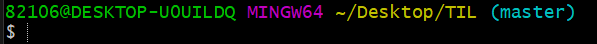

# Git Command

> ​	Git 명령어 정리

# 초기 설정

### 0. init

- `git init`
- 최초에 한번만 하면 된다.
- `.git/` 폴더를 생성해준다.
- 

(위는 처음에는 Desktop/TIL 다음에 (maters) 표시가 없었다. 그 이유는                 git 파일이 아니었기 때문에. 따라서 `git init` 을 쳐서 엔터 쳐줬다.)

(사진이 asset 폴더에 자동적으로 저장된 건, 수업시간에 우리가 파일 -> 환경설정에 들어가서 바꿔줬으므로 자동으로 저장.)

### 1. config

- `git config --global user.email "myemail@gmail.com"`
- `git config --global user.name "myname"`
- 최초에 한번만 하면 된다.

# 커밋 기록

### 1. add

- `git add <추가하고 싶은 파일>`
  - `git add .` : 현재 폴더의 모든 파일과 폴더를 add
- working directory => staging area 로 파일 이동

### 2. commit

- `git commit -m "메세지"`
- 스냅샷을 찍는 동작
- add 되어있는 파일들을 하나의 묶음으로 저장
- 메세지에 들어가는 내용은 기능 단위로

### 3. remote

- `git remote add origin <주소>`
- 원격 저장소와 현재 로컬 저장소를 연결.
- 한번 하면 두번 할 필요 X

### 4.  push

- `git push origin master`
- 깃아 올려줘 origin으로 master를
- 원격 저장소에 로컬 저장소의 데이터를 전송

# 상태 확인

### 1. status

- `git status`
- 현재 git 상태로 출력

### 2. log

- `git log`
- 커밋 기록을 전체 다 출력
- 옵션
  - `--oneline` : author, date 같은 정보를 제외하고 한줄로 출력
  - `--graph` : 커밋들을 점으로 표현하고 그 커밋을 선으로 연결해서 그래프 형태로 출력

### 3. diff

- `git diff`
- 현재 변경사항을 체크(add 하기 전에)

### * 추가파일

### 1. gitignore

- `.gitignore` 파일을 생성 후 git으로 관리하고 싶지 않은 파일들을 저장
- gitignore.io

## 브랜치

### 1. 생성

-  `git branch <브랜치이름>`

### 2. 이동

- `git switch <브랜치이름>` => 최신 문법
- `git checkout <브랜치이름>`=> 옛날 문법

### 3. 삭제

- `git branch -d <브랜치이름>`

### 4. 병합

- git merge <브랜치이름>

- base가 되는 branch로 이동해서 명령어 사용

- 충돌이 발생한 경우 => 충돌을 해결하고 다시 add, commit, push 하기.

  (빨간색 표시가 난 부분을 지우고 다시 add, commit, push 하기)

***** visual studio에서 bash 코드 짜고 싶으면 ctrl shift p => default shell 검색. 후에 ctrl + ~ 표시 같이 누르기. 만약 타자 안쳐지면 쓰레기통 한번 누르고 시작.